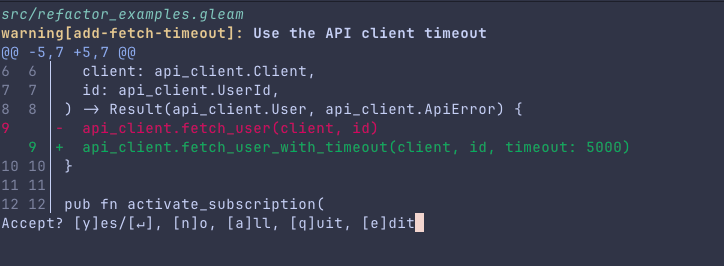

# Gleam ast-grep

This project shows off how to setup [ast-grep](https://github.com/ast-grep/ast-grep) with [Gleam](https://gleam.run/) and concrete use cases that you can try out in your Gleam projects.

The setup is pretty easy. We define a custom language for `ast-grep` which references Gleam's [tree-sitter](https://github.com/gleam-lang/tree-sitter-gleam/) repository.

Gleam's minimal syntax and solid primitives make it an excellent target for more static code analysis tooling. I am sure this is the beginning of a wonderful world of tooling yet to come.

Gleam's compiler is already doing a lot of work for us and gives users many helpful hints about certain code patterns (unused variables, unncessary list spread, etc.). Gleam also has an excellent language server that offers many useful code actions.

You

## Why `ast-grep`?

You can come a loong way with "just" `grep` and don't immediately have to opt for `ast-grep`. But I do think for larger structural changes, linting rule distribution and not having to deal with regex edge cases it is worth exploring.

For one, you don't have to worry about whitespace or new lines or other formatting quirks with regex.

`ast-grep` has an interactive mode, which is helpful for larger refactorings in the style of snapshot testing with [birdie](https://github.com/giacomocavalieri/birdie):



## Setup and Installation

[Install ast-grep](https://github.com/ast-grep/ast-grep#installation) for whatever platform you're on.

Then we build the Gleam parser from the tree sitter repository:

```bash
mkdir -p .ast-grep/parsers
git clone --depth 1 https://github.com/gleam-lang/tree-sitter-gleam .ast-grep/tree-sitter-gleam

# MacOS
tree-sitter build -o .ast-grep/parsers/gleam.dylib .ast-grep/tree-sitter-gleam

# Linux
tree-sitter build -o .ast-grep/parsers/gleam.so .ast-grep/tree-sitter-gleam
```

I have no idea how to anything on Windows, so I cannot tell you how to install that stuff on there.

Now we can configure `ast-grep` and create `sgconfig.yml`:

```yaml
# sgconfig.yml
ruleDirs: [rules]
customLanguages:
  gleam:
    # For MacOS, or gleam.so on Linux
    libraryPath: .ast-grep/parsers/gleam.dylib
    extensions: [gleam]
    # This is important for refactorings (read more on it below)
    expandoChar: z
```

If you already have some rules setup in the `rules/` directory, you can run `ast-grep scan .` to run it on your project.

## Use Cases

### Linting

You can make linting rules very quickly with this setup. There is no official Gleam linter at the time of writing this, so the rules I will use are subjective preferences and not measures of better, worse or idiomatic Gleam code.

A lot of the rules I tried to implement come from the project [glinter](https://github.com/pairshaped/glinter), a linter for Gleam programs written in Gleam.

#### **Result with `String` Error - [rule file](./rules/result_string_error.yml)**

I would argue, that `String` are not very descriptive and makes it difficult to do proper error handling. Ideally, you create a custom Error type for your library or application. So you should not write this code:

```gleam
pub fn wibble() -> Result(wisp.Response, String) {
  Error("User not found")
}
```

but rather:

```gleam
pub type AppError {
  UserNotFound
  DatabaseUnavailable
}

pub fn wibble() -> Result(wisp.Response, AppError) {
  Error(UserNotFound)
}
```

#### **Boolean in Public API - [rule file](./rules/bool_in_public_api.yml)**

`Bool` does not carry any context by itself. `True` or `False` means nothing, without more knowledge about the domain. In a function call - especially without a label - this can lead to very confusing code. So ideally you avoid them at all and replace it with a custom type, especially in the public API of your application or library.

```gleam
pub type Status {
  Published
  Draft
}

pub type Post {
  Post(
    // ... properties ...

    // Just ok and arguably even bad
    published: Bool,

    // Better
    status: Status
  )
}
```

Checkout the rule file here: [rules/bool_in_public_api.yml](./rules/bool_in_public_api.yml)

#### Example Output

[src/app.gleam](./src/app.gleam) contains some example code that triggers the [rules](./rules) setup in this repository. Running `ast-grep scan .` gives us this output:

```console
~/daniellionel01/gleam-ast-grep $ ast-grep scan .
warning[explicit_parameter_types]: Add explicit types to all function parameters
   ┌─ src/app.gleam:12:1
   │
12 │ ╭ pub fn explicit_parameter_types(value) -> Int {
   │                                   -----
13 │ │   value
14 │ │ }
   │ ╰─^
   │
   = Gleam conventions recommend annotations for every module function.

warning[boolean_blindness]: Use a descriptive custom type instead of Bool in a public API
   ┌─ src/app.gleam:16:26
   │
16 │ ╭ pub fn boolean_blindness(enabled: Bool) -> Bool {
   │   ---                      ^^^^^^^^^^^^^
17 │ │   enabled
18 │ │ }
   │ ╰─'
   │
   = Keep Bool when two unnamed states are clear and cannot be confused.

warning[result_string_error]: Use a custom error type instead of String
   ┌─ src/app.gleam:8:1
   │
 8 │ ╭ pub fn stringly_typed_error() -> Result(Int, String) {
   │                                    -------------------
 9 │ │   Error("dummy error")
10 │ │ }
   │ ╰─^
   │
   = String errors cannot be pattern matched by callers.

warning[explicit_return_type]: Functions should have explicit return types
   ┌─ test/app_test.gleam:8:1
   │
 8 │ ╭ pub fn hello_world_test() {
   · │
13 │ │ }
   │ ╰─^
   │
   = This gives us more information in the AST for analysis.
```

### Refactors

Unfortunately at the time of writing this (September 2026), the grammar defined in the Gleam tree sitter
repository is not compatible with the metavariable capture syntax of `ast-grep` that is very important
for reliable rewrite rules.

This is because Gleam only allows lower cased names to be parsed, but `ast-grep` metavariables are uppercased.

So in this example rule:

```yaml
rule:
  pattern: api_client.fetch_user($CLIENT, $ID)
fix: "api_client.fetch_user_with_timeout($CLIENT, $ID, timeout: 5000)"
```

`$CLIENT` and `$ID` cannot be captured correctly.

This repository supplies a patch for the current Gleam tree sitter repository, that you can apply like this:

```bash
git -C .ast-grep/tree-sitter-gleam apply ../../patches/tree-sitter-gleam-metavariables.patch
(cd .ast-grep/tree-sitter-gleam && tree-sitter generate)
```

This repository also contains examples of potential refactorings of some dummy modules, that you can try out.

```bash
ast-grep scan --rule refactors/add_fetch_timeout.yml --interactive
ast-grep scan --rule refactors/introduce_mail_message.yml --interactive
ast-grep scan --rule refactors/replace_bool_status.yml --interactive
```

### Library Specific Rules

I think a big opportunity for `ast-grep` are rules specific to your Gleam library. This could be [lustre](https://github.com/lustre-labs/lustre), [birdie](https://github.com/giacomocavalieri/birdie), [gleam_otp](https://github.com/gleam-lang/otp), [wisp](https://github.com/gleam-wisp/wisp) or the [Gleam standard library](https://gleam-stdlib.hexdocs.pm/).

Here are some rules I was able to come up with and I think are valid to look out for:

**Standard Library**

- [stdlib_prefer_list_is_empty](./rules/stdlib_prefer_list_is_empty.yml)
- [stdlib_prefer_list_not_empty](./rules/stdlib_prefer_list_not_empty.yml)
- [stdlib_prefer_flat_map](./rules/stdlib_prefer_flat_map.yml)
- [stdlib_prefer_string_is_empty](./rules/stdlib_prefer_string_is_empty.yml)
- [stdlib_prefer_string_not_empty](./rules/stdlib_prefer_string_not_empty.yml)

**Erlang & OTP**

- [otp_atom_create_non_literal](./rules/otp_atom_create_non_literal.yml)
- [otp_process_kill](./rules/otp_process_kill.yml)
- [otp_process_name_creation](./rules/otp_process_name_creation.yml)
- [otp_spawn_unlinked](./rules/otp_spawn_unlinked.yml)

**Birdie**

- [birdie_literal_snapshot_title](./rules/birdie_literal_snapshot_title.yml)
- [birdie_snap_in_collection_callback](./rules/birdie_snap_in_collection_callback.yml)

**Wisp**

- [wisp_plaintext_cookie](./rules/wisp_plaintext_cookie.yml)

## Caveats

With `ast-grep` we can find a lot of useful patterns to look for in Gleam code. However there are many limitations going off purely the AST
of our programs and limit the amount of information we can extract. These are limitations of ast-grep itself and not Gleam specific.

One example is type information. `ast-grep` fundamentally does not get any extra information about the types in your program. For this function:

```gleam
pub fn wibble() {
  "wobble"
}
```

`ast-grep` will not know the return type. However, if you always make sure to add explicit return types to your functions like this:

```gleam
pub fn wibble() -> String {
  "wobble"
}
```

Then `ast-grep` rules can actually work with that. A linting rule you can use to make sure all of your functions have explicit return types can look like this:

```yaml
id: explicit_return_type
language: gleam
severity: warning
message: Add an explicit return type
rule:
  all:
    - kind: function
    - not:
        has:
          field: return_type
          kind: type
```

More gotchas are documented in Gleams [tree-sitter](https://github.com/gleam-lang/tree-sitter-gleam/) repository: https://github.com/gleam-lang/tree-sitter-gleam/#various-gotchas

I also think it's worth noting that even though Gleam's syntax is very minimalistic, it is still sometimes hard to think about all of the patterns to cover.
A function call with an argument has to be covered in at least 3 different ways:

```yml
# Call
pattern: wibble.wobble($VALUE)
pattern: $VALUE |> wibble.wobble
pattern: $VALUE |> wibble.wobble()
```

There are probably ways around this and you can write reusable utility functions in `ast-grep`. But definitely something to think about. Always good to test your
rules on a bunch of syntax variations of something and put a few random assignments and pipes in there just to be sure.

## Future Work & Ideas

`ast-grep` is a very versatile tool. It can be used for linting, large refactorings, codemods, inventory, search and probably other things I can't
think of right now.

And to make it loop back to Gleam again. The team behind Gleam is very good at making sure that tooling and features solve real world problems with evidence behind them. Giving people a couple dozen linting rules is probably not going to benefit a lot of people.

I can see a lot more value in library and application specific rules. If you are following [DDD](https://en.wikipedia.org/wiki/Domain-driven_design) you might want to setup some module boundary rules. If you're noticing patterns specific to your application or construction of HTML components with [lustre](https://github.com/lustre-labs/lustre), you might want to setup a rule to catch that again in the future. Or prevent accessing env variables outside of your module that defines a schema for it. As with all tooling, you can get very creative with it, but also easy to get distracted! Attention is all you need. (hehe)

I found a few other projects online that make use of `ast-grep` which is definitely worth looking at for inspiration and learning how to integrate
`ast-grep` into your project and CI.

- https://github.com/Kong/kong
- https://github.com/qdrant/qdrant
- https://github.com/nushell/nushell
- https://github.com/CesiumGS/cesium
- https://github.com/apache/lucene
